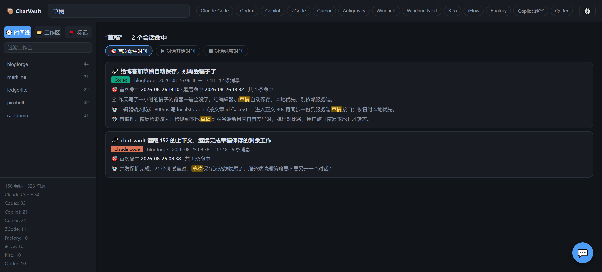
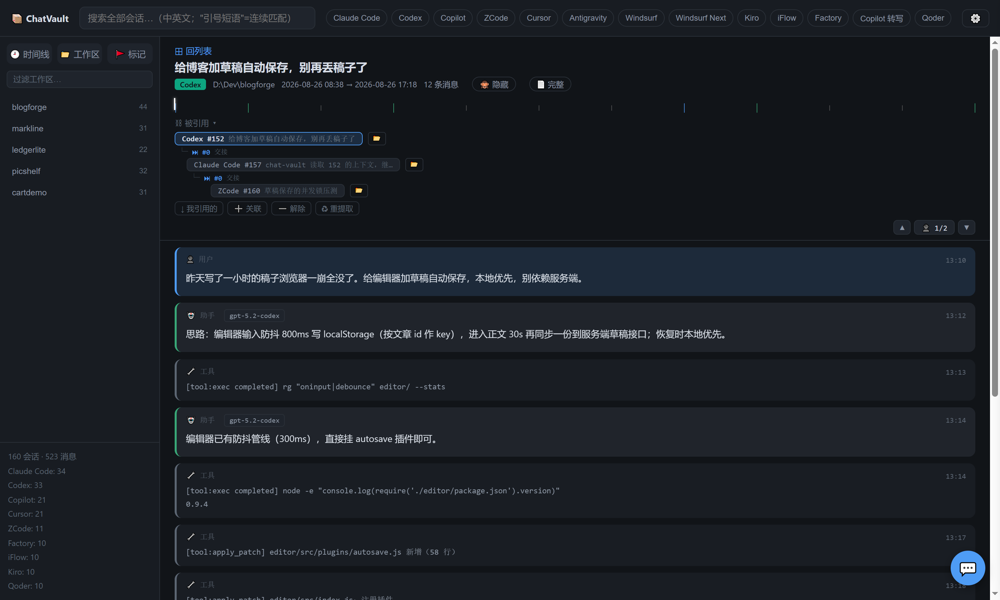
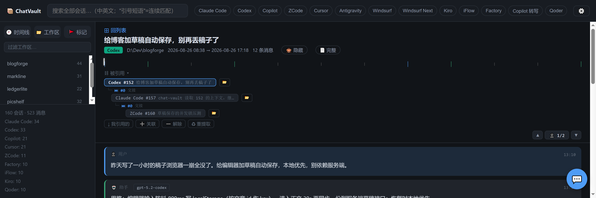
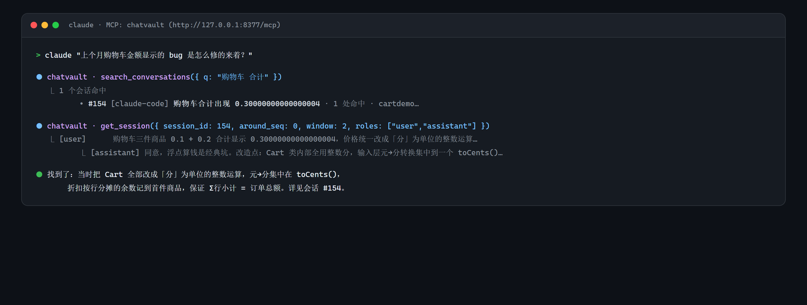
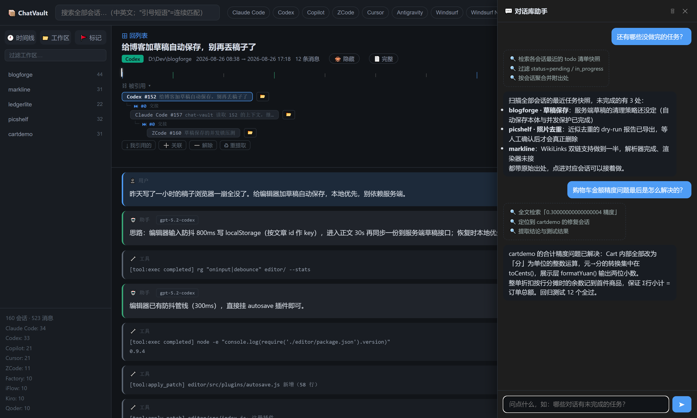

# ChatVault · 薪传

一个把多个 AI Agent 的对话收拢到一起、能搜、能看、能在 Agent 之间继续的东西。

你在 Claude Code / Codex / Copilot / Cursor / Antigravity / Windsurf / Kiro 这些工具里产生的对话，原本散在各自的目录里。ChatVault 把它们同步到一个本地库里，给你一个统一的地方找、看、接着做。

数据源只读，不改原文件。需要 Node.js ≥ 22.5（导入 DeepSeek Harness 的 zstd 会话日志需 ≥ 22.19，旧版自动跳过该 Agent），不用 `npm install`。支持 Windows / macOS / Linux。

> 已链接认可 [LINUX DO 社区](https://linux.do/)

## 它能做什么

- **共享同一份记忆**：不同 Agent 的对话不再各说各话。A 里踩的坑、B 里定的方案，可以直接在另一个 Agent 的上下文里继续。
- **多种找法**：关键词搜（支持中文）、按时间线看、按工作区/ Agent 过滤、按会话链跳转。搜得到 1623，也能顺藤摸到和它有关的一整条工作线。
- **好用的浏览**：时间线、作息图、消息导航、折叠/收藏/标记。大会话也跑得动。
- **MCP 接口**：Agent 自己就能查库、读上下文、看待办。不用你手抄粘贴。
- **直接问**：在 UI 右下角用自然语言问库，比如"还有哪些没做完的任务"。
- **只在本地**：默认只监听本机，可后台常驻、开机自启。

## 快速开始

```bash
# 方式一：npm 安装（推荐，升级方便）
npm install -g chat-vault

# 方式二：免安装直接跑
npx chat-vault@latest serve

# 方式三：git clone（想改代码就用这个）
git clone https://github.com/puppywang/chat-vault.git
cd chat-vault && npm start
```

装好后（或 clone 后）常用命令：

```bash
chat-vault serve --port 8377   # 启动 Web UI，默认 http://127.0.0.1:8377
chat-vault sync                # 手动同步一次
chat-vault search "入水检测"    # 命令行搜索
chat-vault stats               # 看看库里有多少

# clone 的话也可以用 node 直接跑
node src/cli.js serve --port 8377
```

**日常只要开着 `serve` 就行**：它会监听各 Agent 的数据目录，有新对话自动同步，不用每次手动 `sync`。Windows 可以双击 `start-chatvault.bat`，也可以设为开机自启（见底部）。

## 界面在干什么

- **搜索**：全文搜，中文也能搜。结果按会话聚合，能按"首次命中/开始/结束时间"排序。
- **时间线 / 工作区**：按天、按项目、按 Agent 过滤。工作区支持多选，作息图能看出你几点在干活。
- **会话内**：可以搜当前会话、按用户消息跳转、复制某条消息的链接。
- **会话链**：自动识别"继续对话"的引用（比如 `chat-vault 读取 N 对话`、粘贴的 `#/session/N` 链接），把同一条工作线串起来。卡片上会打上链标记，详情页有引用树可以跳来跳去。

## Agent 怎么用

所有 Agent 走同一个 HTTP MCP 入口（需先跑 `serve`）：

```
http://127.0.0.1:8377/mcp
```

配置示例：

```jsonc
{ "mcpServers": { "chatvault": { "type": "http", "url": "http://127.0.0.1:8377/mcp" } } }
```

常用工具：

- `search_conversations` — 搜库
- `get_session` — 读某个会话（支持只读某几条、或以命中为中心的上下文窗口）
- `list_sessions` / `list_workspaces` / `get_stats` — 浏览
- `get_session_chain` — 读一条会话所在的工作线（双向：我引用了谁 / 谁引用了我）
- `list_task_states` / `list_flagged` — 看待办和收藏

日常用法就是：`请用 chat-vault 读取 1623 对话，然后继续完成剩余工作`，下一 个 Agent 会自己顺着链把上下文找全。

## 问库

UI 右下角有一个对话入口，可以直接问库。需要配一个 OpenAI 兼容的模型（Ollama / vLLM / 自建网关都行）。在"设置"里填好 `baseUrl` / `model` / `apiKey` 就能用，问答会自动归档。

## 支持哪些 Agent

Claude Code / Codex / Copilot / Cursor / Antigravity / Windsurf / Windsurf-Next / Kiro / iFlow / Factory / Qoder / ZCode / DeepSeek Harness 等 14 个。新增 Agent 按 `docs/AGENT-INTEGRATION-GUIDE.md` 的五步接入。

## 数据放哪

都在 `~/.chat-vault/`（旧的 `~/.agent-exporter/` 会自动迁移过来）：

- `chat-vault.db` — 库
- `images/` — 对话里的图片
- `config.json` / `logs/` — 配置和日志

删库也能重建，源文件还在各 Agent 自己的目录里。`--db PATH` 可以改位置。

## 界面速览

> 以下截图均由 `scripts/make-demo-db.js` 生成的**合成数据**渲染（全部虚构，不含任何真实项目与对话）。想自己跑一套演示：
> `node scripts/make-demo-db.js --out demo.db && node src/cli.js serve --port 8378 --no-watch --no-sync --db demo.db`

**时间线 + 全文搜索**：所有对话在一处，工作区 / Agent 过滤，命中关键词高亮。



**会话详情**：消息流（用户 / 助手 / 工具分色）、吸顶刻度条、用户消息导航。



**会话链 / 引用树**：一条工作线在多个 Agent 之间接力（Codex 起头 → Claude Code 续做 → ZCode 压测），链由用户消息里的 `chat-vault 读取 #N` 指令自动提取。



**MCP 调用**：agent 挂上 `chatvault` 后自动检索共享记忆——不用手抄上下文。



**问库助手**：右下角自然语言提问，回答带检索过程与出处。



## 备注

- 默认只监听 `127.0.0.1`，需要局域网访问可在设置里打开。
- Copilot 的本地会话会被 VS Code 定期清理，常驻 `serve` 能避免丢数据。
- 开机自启（Windows）：`powershell -NoProfile -ExecutionPolicy Bypass -File scripts\install-autostart.ps1`
